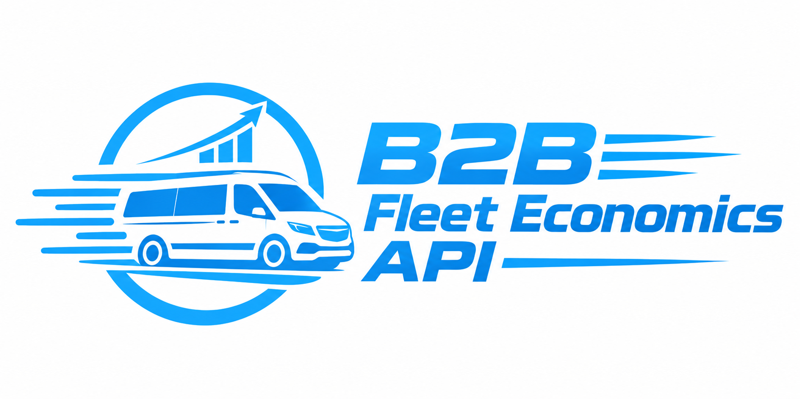
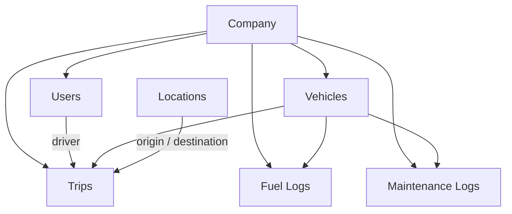
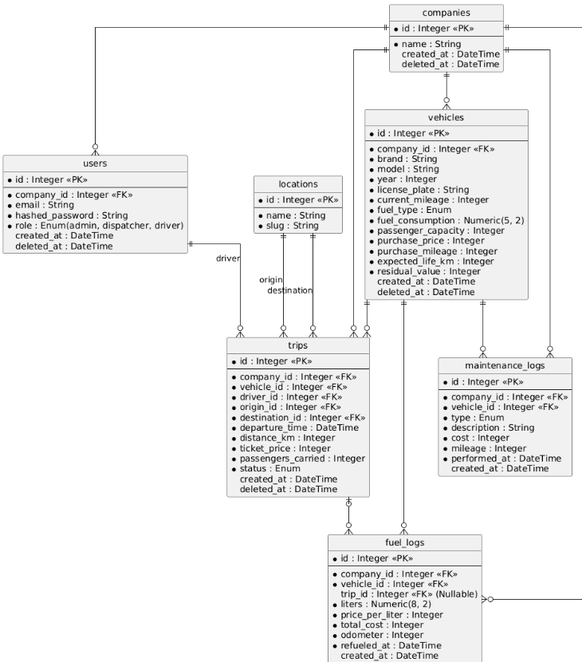

<p align="center">
  
</p>
# 🚚 B2B Fleet Economics API

> **REST API для управління автопарком мікроперевізників, обліку рейсів і витрат та розрахунку реальної юніт-економіки транспортних операцій.**

[](https://www.python.org/)
[](https://fastapi.tiangolo.com/)
[](https://www.sqlalchemy.org/)
[](https://www.postgresql.org/)
[](#)

---

## 📌 Концепт

### The Hook

Мікроперевізники, які виконують регулярні міжміські рейси, не завжди бачать **реальну рентабельність своїх перевезень**.

Простий підрахунок:

```text
Дохід від квитків − витрати на пальне = "прибуток"
```

не враховує технічне обслуговування, ремонт та поступову втрату вартості автомобіля.

У результаті рейс може виглядати прибутковим у короткостроковій перспективі, хоча після врахування повної собівартості транспортної операції економічний результат буде значно нижчим.

### Рішення

**B2B Fleet Economics API** дозволяє компаніям:

* вести облік автомобілів;
* реєструвати та контролювати рейси;
* фіксувати витрати на пальне;
* вести історію технічного обслуговування та ремонтів;
* керувати водіями та ролями користувачів;
* ізолювати дані різних компаній;
* розраховувати економічні показники автомобілів та рейсів.

Головна бізнес-функція системи — **`EconomicsService`**, який динамічно розраховує фінансові та операційні метрики на основі первинних даних.

---

## ✈️ Make it yours

Концепція адаптує принципи авіаційних метрик **CASK** та **RASK** для наземних мікроперевезень.

* **CASK** — Cost per Available Seat Kilometer
* **RASK** — Revenue per Available Seat Kilometer

Для автомобільних перевезень доступна пасажиромісткість також є важливою: два автомобілі можуть виконувати однаковий маршрут, але мати принципово різну економіку через місткість, завантаженість, витрату пального та собівартість кілометра.

Наприклад, система може порівняти:

```text
Маршрут: Київ → Черкаси

Автомобіль A
8 місць
4 пасажири
висока витрата пального

vs.

Автомобіль B
4 місця
4 пасажири
нижча собівартість
```

і показати різницю в:

* Load Factor;
* Revenue/km;
* Cost/km;
* Profit/km;
* CASK;
* RASK;
* Net Profit.

Таким чином, API використовується не лише для зберігання даних, а й для **аналізу ефективності транспортних операцій**.

---

# 🛠 Технологічний стек

| Компонент              | Технологія           |
| ---------------------- | -------------------- |
| Language               | Python 3.11+         |
| Framework              | FastAPI              |
| ORM                    | SQLAlchemy 2.0       |
| Database (development) | SQLite               |
| Database (production)  | PostgreSQL           |
| Migrations             | Alembic              |
| Validation             | Pydantic             |
| Authentication         | JWT                  |
| Password hashing       | bcrypt / Argon2      |
| Testing                | pytest               |
| API documentation      | OpenAPI / Swagger UI |
| Deployment             | Render / Railway     |
| CI/CD                  | GitHub Actions       |

---

# 🏗 Архітектура

Система використовує **multi-tenant B2B architecture**.

Кожна компанія є окремим tenant'ом, а її користувачі, автомобілі, рейси та фінансові записи ізольовані від даних інших компаній.



### Основний принцип ізоляції

```text
JWT
 ↓
current_user
 ↓
current_user.company_id
 ↓
tenant-scoped queries
 ↓
Company-owned data
```

Користувач не може отримати доступ до даних іншої компанії лише змінивши `id` ресурсу в URL.

---

# 🗄️ Database Schema

> Усі грошові значення зберігаються як `Integer` у копійках.
> Значення, для яких важлива десяткова точність, зберігаються через `Numeric`.

## Entity Relationship Diagram

!

### Основні сутності

```text
companies
    │
    ├── users
    │
    ├── vehicles
    │       ├── fuel_logs
    │       └── maintenance_logs
    │
    └── trips
            ├── driver
            ├── vehicle
            ├── origin
            └── destination

locations
    └── trips
```

---

## 1. `companies`

**B2B tenants / компанії**

| Field        | Type               | Description    |
| ------------ | ------------------ | -------------- |
| `id`         | Integer PK         | Ідентифікатор  |
| `name`       | String             | Назва компанії |
| `created_at` | DateTime           | Дата створення |
| `deleted_at` | DateTime, nullable | Soft Delete    |

---

## 2. `users`

**Користувачі та ролі**

| Field             | Type               | Description                     |
| ----------------- | ------------------ | ------------------------------- |
| `id`              | Integer PK         | Ідентифікатор                   |
| `company_id`      | Integer FK         | Компанія користувача            |
| `email`           | String, unique     | Email                           |
| `hashed_password` | String             | Хеш пароля                      |
| `role`            | Enum               | `admin`, `dispatcher`, `driver` |
| `created_at`      | DateTime           | Дата створення                  |
| `deleted_at`      | DateTime, nullable | Soft Delete                     |

### Ролі

| Role         | Responsibilities                                    |
| ------------ | --------------------------------------------------- |
| `admin`      | Повний контроль над компанією                       |
| `dispatcher` | Управління автопарком та рейсами                    |
| `driver`     | Доступ до власних рейсів та призначених автомобілів |

---

## 3. `locations`

**Глобальний довідник міст**

| Field  | Type           | Description        |
| ------ | -------------- | ------------------ |
| `id`   | Integer PK     | Ідентифікатор      |
| `name` | String, unique | Назва міста        |
| `slug` | String, unique | URL-friendly назва |

Наприклад:

```text
name: Черкаси
slug: cherkasy
```

Довідник є спільним для всіх компаній.

---

## 4. `vehicles`

**Автомобілі компанії**

| Field                | Type               | Description                           |
| -------------------- | ------------------ | ------------------------------------- |
| `id`                 | Integer PK         | Ідентифікатор                         |
| `company_id`         | Integer FK         | Компанія-власник                      |
| `brand`              | String             | Марка                                 |
| `model`              | String             | Модель                                |
| `year`               | Integer            | Рік випуску                           |
| `license_plate`      | String, unique     | Державний номер                       |
| `current_mileage`    | Integer            | Поточний пробіг                       |
| `fuel_type`          | Enum               | `petrol`, `diesel`, `gas`, `electric` |
| `fuel_consumption`   | Numeric(5,2)       | Витрата, л/100 км                     |
| `passenger_capacity` | Integer            | Пасажиромісткість                     |
| `purchase_price`     | Integer            | Ціна покупки, копійки                 |
| `purchase_mileage`   | Integer            | Пробіг при покупці                    |
| `expected_life_km`   | Integer            | Плановий ресурс після покупки         |
| `residual_value`     | Integer            | Очікувана залишкова вартість          |
| `created_at`         | DateTime           | Дата створення                        |
| `deleted_at`         | DateTime, nullable | Soft Delete                           |

---

## 5. `trips`

**Рейси**

| Field                | Type               | Description                                         |
| -------------------- | ------------------ | --------------------------------------------------- |
| `id`                 | Integer PK         | Ідентифікатор                                       |
| `company_id`         | Integer FK         | Tenant key                                          |
| `vehicle_id`         | Integer FK         | Автомобіль                                          |
| `driver_id`          | Integer FK         | Водій                                               |
| `origin_id`          | Integer FK         | Початкова локація                                   |
| `destination_id`     | Integer FK         | Кінцева локація                                     |
| `departure_time`     | DateTime           | Час відправлення                                    |
| `distance_km`        | Integer            | Відстань                                            |
| `ticket_price`       | Integer            | Ціна одного квитка, копійки                         |
| `passengers_carried` | Integer            | Фактична кількість пасажирів                        |
| `status`             | Enum               | `scheduled`, `in_progress`, `completed`, `canceled` |
| `created_at`         | DateTime           | Дата створення                                      |
| `deleted_at`         | DateTime, nullable | Soft Delete                                         |

### Tenant consistency

Для кожного рейсу виконується правило:

```text
trip.company_id
      ==
vehicle.company_id
      ==
driver.company_id
```

---

## 6. `fuel_logs`

**Витрати на пальне / OpEx**

| Field             | Type                 | Description                |
| ----------------- | -------------------- | -------------------------- |
| `id`              | Integer PK           | Ідентифікатор              |
| `company_id`      | Integer FK           | Tenant key                 |
| `vehicle_id`      | Integer FK           | Автомобіль                 |
| `trip_id`         | Integer FK, nullable | Пов'язаний рейс            |
| `liters`          | Numeric(8,2)         | Кількість літрів           |
| `price_per_liter` | Integer              | Ціна за літр, копійки      |
| `total_cost`      | Integer              | Загальна вартість, копійки |
| `odometer`        | Integer              | Пробіг на момент заправки  |
| `refueled_at`     | DateTime             | Час заправки               |
| `created_at`      | DateTime             | Дата створення             |

`trip_id` може бути `NULL`, оскільки заправка не обов'язково виконується безпосередньо під конкретний рейс.

---

## 7. `maintenance_logs`

**Технічне обслуговування та ремонт**

| Field          | Type       | Description                                        |
| -------------- | ---------- | -------------------------------------------------- |
| `id`           | Integer PK | Ідентифікатор                                      |
| `company_id`   | Integer FK | Tenant key                                         |
| `vehicle_id`   | Integer FK | Автомобіль                                         |
| `type`         | Enum       | `repair`, `oil_change`, `tires`, `brakes`, `other` |
| `description`  | String     | Опис робіт                                         |
| `cost`         | Integer    | Вартість, копійки                                  |
| `mileage`      | Integer    | Пробіг на момент обслуговування                    |
| `performed_at` | DateTime   | Дата виконання                                     |
| `created_at`   | DateTime   | Дата створення                                     |

---

# 🔐 Security & Consistency

## Strict Tenant Isolation

`company_id` **не приймається від клієнта** при створенні tenant-owned ресурсів.

Замість цього:

```text
JWT
 ↓
current_user.company_id
 ↓
company_id
```

Backend сам визначає, до якої компанії належить новий ресурс.

Це запобігає ситуації, коли користувач намагається створити або отримати ресурс іншої компанії, просто змінивши `company_id`.

---

## Cross-Entity Consistency

При роботі з пов'язаними ресурсами система перевіряє належність до одного tenant'а.

Наприклад, для створення рейсу:

```text
current_user.company_id
        │
        ├── driver.company_id
        │
        └── vehicle.company_id
```

Усі значення повинні відповідати одній компанії.

---

## Role-Based Access Control

Доступ до операцій визначається роллю користувача:

```text
admin
  ├── users
  ├── vehicles
  ├── trips
  └── financial data

dispatcher
  ├── vehicles
  ├── trips
  └── drivers

driver
  ├── assigned vehicle
  └── own trips
```

---

# 📊 Business Logic

Головна бізнес-логіка реалізується через `EconomicsService`.

Розраховані економічні показники **не зберігаються у базі даних**. Вони динамічно обчислюються на основі первинних операційних даних.

## Основні метрики

### Revenue

```text
Revenue = ticket_price × passengers_carried
```

### Depreciation per km

```text
Depreciation per km =
    (purchase_price - residual_value)
    / expected_life_km
```

### Load Factor

```text
Load Factor =
    passengers_carried / passenger_capacity
```

### Cost per km

Враховує:

* витрати на пальне;
* технічне обслуговування та ремонт;
* амортизацію.

### Net Profit

```text
Net Profit =
    Revenue - Total Costs
```

### CASK / RASK

Система адаптує принципи авіаційних метрик до автомобільних перевезень:

```text
ASK = distance_km × passenger_capacity

RASK = Revenue / ASK

CASK = Total Cost / ASK
```

---

# 🔌 API

Основні endpoint'и системи:

## Authentication

```http
POST /auth/register
POST /auth/login
```

## Vehicles

```http
GET    /vehicles
GET    /vehicles/{id}
POST   /vehicles
PATCH  /vehicles/{id}
DELETE /vehicles/{id}
```

## Trips

```http
GET    /trips
GET    /trips/{id}
POST   /trips
PATCH  /trips/{id}
DELETE /trips/{id}
```

## Fuel Logs

```http
GET    /fuel-logs
POST   /fuel-logs
PATCH  /fuel-logs/{id}
DELETE /fuel-logs/{id}
```

## Maintenance Logs

```http
GET    /maintenance-logs
POST   /maintenance-logs
PATCH  /maintenance-logs/{id}
DELETE /maintenance-logs/{id}
```

## Economics

```http
GET /vehicles/{id}/economics
```

Приклад із періодом:

```http
GET /vehicles/12/economics?from=2026-09-01&to=2026-09-30
```

> Конкретний набір endpoint'ів може розширюватися під час реалізації.

---

# 🚀 Roadmap

* [x] **Етап 1 — Architecture**

  * [x] Проєктування предметної області
  * [x] Проєктування ER-моделі
  * [x] Визначення tenant isolation
  * [x] Визначення ролей та RBAC
  * [x] Ініціалізація SQLAlchemy
  * [x] Початкові Alembic migrations

* [x] **Етап 2 — Authentication & Authorization**

  * [x] User registration
  * [x] Password hashing
  * [x] JWT authentication
  * [x] RBAC
  * [x] Tenant isolation

* [ ] **Етап 3 — Core CRUD**

  * [x] Vehicles CRUD
  * [x] Trips CRUD
  * [x] Maintenance Logs CRUD
  * [x] Locations

* [ ] **Етап 4 — Fuel & Query Features**

  * [ ] Fuel Logs
  * [ ] Pagination
  * [ ] Filtering
  * [ ] Sorting

* [ ] **Етап 5 — Economics Engine**

  * [ ] EconomicsService
  * [ ] Cost per km
  * [ ] Profit per km
  * [ ] Depreciation
  * [ ] Load Factor
  * [ ] CASK / RASK

* [ ] **Етап 6 — Quality & Security**

  * [ ] Automated tests with pytest
  * [ ] Structured logging
  * [ ] Rate limiting
  * [ ] Error handling
  * [ ] Security review

* [ ] **Етап 7 — Production**

  * [ ] PostgreSQL
  * [ ] Docker
  * [ ] GitHub Actions
  * [ ] Production deployment
  * [ ] Public API documentation

---

# 💻 Local Development

## 1. Clone repository

```bash
git clone <repository-url>
cd fleet-economics-api
```

## 2. Create virtual environment

### Windows

```powershell
python -m venv venv
venv\Scripts\activate
```

### Linux / macOS

```bash
python3 -m venv venv
source venv/bin/activate
```

## 3. Install dependencies

```bash
pip install -r requirements.txt
```

## 4. Configure environment variables

Copy `.env.example` to `.env`:

### Windows

```powershell
copy .env.example .env
```

### Linux / macOS

```bash
cp .env.example .env
```

Configure the required environment variables:

```env
DATABASE_URL=sqlite:///./fleet.db
JWT_SECRET_KEY=change-me
```

> **Never commit `.env` to the repository.**
> Use `.env.example` for documenting required variables.

## 5. Apply database migrations

```bash
alembic upgrade head
```

## 6. Start development server

```bash
uvicorn src.main:app --reload
```

The API will be available at:

```text
http://127.0.0.1:8000
```

---

# 📖 API Documentation

FastAPI automatically generates OpenAPI documentation.

After starting the application:

### Swagger UI

```text
http://127.0.0.1:8000/docs
```

### ReDoc

```text
http://127.0.0.1:8000/redoc
```

---

# 🧪 Testing

The project uses `pytest` for automated testing.

Planned test coverage includes:

* user registration and authentication;
* password hashing;
* JWT validation;
* RBAC;
* tenant isolation;
* CRUD operations;
* validation errors;
* ownership checks;
* economics calculations;
* prevention of cross-company data access.

Run tests with:

```bash
pytest
```

---

# 🌐 Deployment

The production environment is planned to use:

* **PostgreSQL** as the production database;
* **Docker** for containerization;
* **Render / Railway** for deployment;
* **GitHub Actions** for CI/CD;
* environment variables for secrets and configuration.

SQLite is intended primarily for local development.

---

# ⚠️ Current Limitations & TODO

The project is under active development.

Planned improvements include:

* advanced reporting;
* more detailed expense allocation;
* additional economics metrics;
* improved filtering and analytics;
* expanded test coverage;
* production monitoring;
* API versioning if required by future development.

---

# 📄 License

This project is developed for educational and portfolio purposes.
